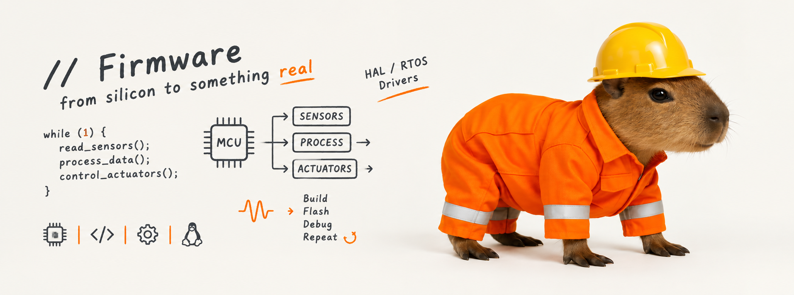
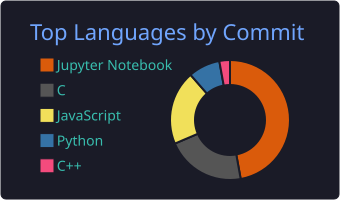
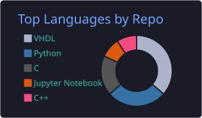
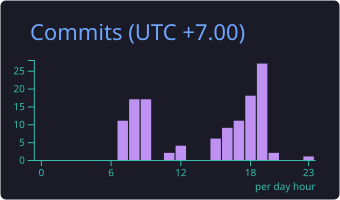

# Made Wena Harilegawa

**Firmware & Embedded Systems Engineer** · Electrical Engineering Student

---

## ⚡ About

I write low-level code for microcontrollers and FPGAs, and build the IoT systems around them.

- 🔧 Firmware on ESP32 (ESP-IDF) and Zephyr
- 🔌 Digital design in VHDL, synthesized with Vivado
- 🤖 Robotics and edge computing on Raspberry Pi and ROS 2
- 📡 IoT device management over MQTT and WebSocket

---

## 🚀 Flagship

### [AsuraCore](https://github.com/WenaHarle/Asuracore) — IoT Device Management Platform

A modular IoT platform for device communication, monitoring, and control.

`MQTT` · `WebSocket` · `Telemetry` · `Remote control` · `Device API`

---

## 🛠️ Projects

| | Project | What it is |
|---|---|---|
| 🔩 | [Self-Healing Firmware](https://github.com/WenaHarle/Self_Healing_Firmware) | Firmware that detects faults and recovers on its own |
| ⌨️ | [ESP HID](https://github.com/WenaHarle/ESP_HID) | Human interface device on ESP32 |
| 🌀 | [Zephyr Indonesia](https://github.com/WenaHarle/Zephyr_Indonesia) | Zephyr RTOS work and resources |
| 🧠 | [SNN on FPGA](https://github.com/WenaHarle/SNN4FPGA) | Spiking neural network in hardware |
| 💾 | [Intel 4004 (VHDL)](https://github.com/WenaHarle/simple_intel_4004_vhdl) | Simple 4004 CPU in VHDL |
| ✖️ | [3-bit Shift and Add Multiplier](https://github.com/WenaHarle/Shift_and_Add_3bit_Mutiplier) | Sequential multiplier design |
| ✖️ | [4-bit Multiplier (ROM)](https://github.com/WenaHarle/4-Bit-Shift-and-Add-Binary-Multiplier-Using-ROM) | Shift and add multiplier using ROM |
| 🐾 | [Quadpod Robot](https://github.com/WenaHarle/quadpod-robot) | Four-legged walking robot |
| 🦾 | [Humanoid Simulation](https://github.com/WenaHarle/Simulation_22) | Humanoid robot simulation |
| 🖐️ | [Sign Language Detection](https://github.com/WenaHarle/sign_language_detection_raspberry) | Edge inference on Raspberry Pi |

---

## 📊 GitHub Stats

---

## 🧰 Tech Stack

- **Firmware:** ESP32, ESP-IDF, Zephyr, FreeRTOS
- **Hardware:** FPGA (Vivado), VHDL, NGSpice, digital design
- **Protocols:** MQTT, WebSocket, HID, Wi-Fi, BLE
- **Backend (supporting):** FastAPI, Django, InfluxDB

---

## 📚 Learning Resources

- [ESP-IDF Tutorial (Bahasa)](https://github.com/WenaHarle/espidf-tutorial-bahasa)
- [FPGA Learning](https://github.com/WenaHarle/FPGA_LEARNING)
- [ROS 2 Guide](https://github.com/WenaHarle/ROS2_GUIDE)

---

